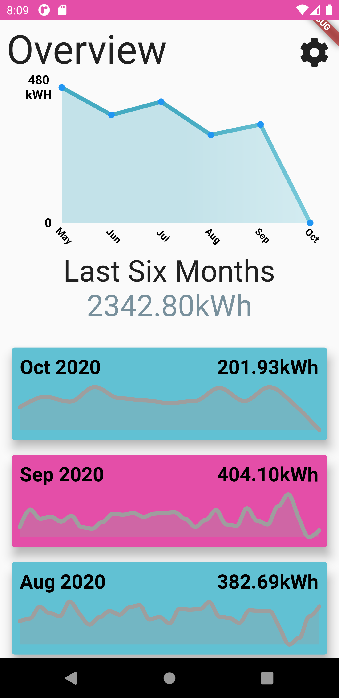

# Squiddy

Squiddy is an Android/iOS client for Octopus Energy. It allows you to view energy usage by month and by day. The app will currently only get the last year of data on your account. You must also generate and use your Octopus Energy developer API key to access energy data associated with your account.

    
    
    
    

## Still to-do

- [ ] Desktop/web version
- [ ] Get readings > 1 year old 
- [ ] Store readings locally, only downloading new readings 
- [ ] Estimate monthly energy usage/cost

## Help

View the [FAQ]() for help using the app.

## Issues 

If you encounter issues with the software please report them [here]().

## Building the app

The app is built and developed using [Google Flutter](https://flutter.dev/). The app has been built and tested using Flutter 1.22.0. You can use your preferred IDE or the command-line tools to build and run the application. For more detailed instructions, please consult the Flutter [online documentation](https://flutter.dev/docs).

### Clean

`flutter clean`

`flutter pub get`

### Run

`flutter run -d <DeviceName>`

### Build

`flutter build apk --release`
